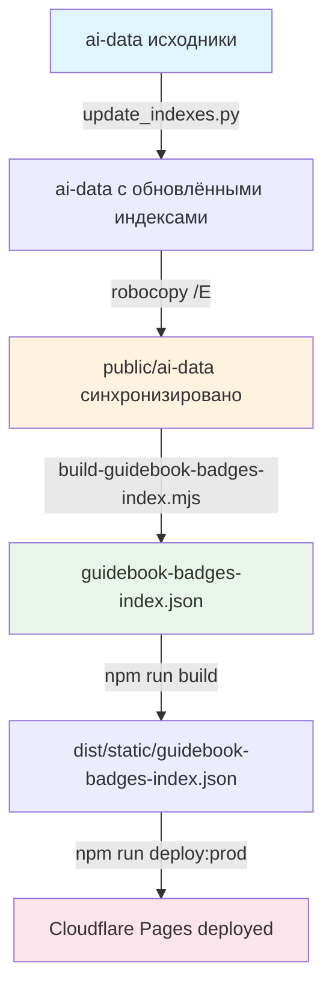

# Чек-лист обновления Путеводителя для cf-api

Этот документ описывает полный процесс синхронизации данных Путеводителя при любых изменениях в `ai-data`. Используйте его каждый раз, когда обновляете содержимое значков, категорий или уровней.

## Когда использовать этот чек-лист

- ✅ Добавили новый значок или уровень
- ✅ Изменили описание, критерии или другие поля значка
- ✅ Обновили категорию или её вступление
- ✅ Пересчитали индексы в репозитории Путеводителя
- ✅ Синхронизировали `ai-data` → `public/ai-data`

## Поток данных



## Пошаговая инструкция

### Шаг 1: Пересчёт индексов в репозитории Путеводителя

**Цель:** Обновить `MASTER_INDEX.json` и все `category-*/index.json` после изменений в данных.

**Действия:**

1. Перейдите в репозиторий Путеводителя:
   ```powershell
   cd "D:\Development\Путеводитель web_new"
   ```

2. Проверьте наличие скрипта:
   ```powershell
   Test-Path "update_indexes.py"
   ```
   Если файл не найден, пропустите этот шаг (индексы могут быть актуальными).

3. Запустите пересчёт индексов:
   ```powershell
   python update_indexes.py
   ```

4. **Проверка:** Убедитесь, что файлы обновились:
   ```powershell
   # Проверка времени изменения MASTER_INDEX.json
   (Get-Item "ai-data\MASTER_INDEX.json").LastWriteTime
   
   # Проверка, что файл содержит актуальные данные
   Get-Content "ai-data\MASTER_INDEX.json" | Select-String -Pattern '"lastUpdated"'
   ```

**Ожидаемый результат:** В консоли должно быть сообщение об успешном обновлении индексов, файл `ai-data/MASTER_INDEX.json` должен иметь свежую дату изменения.

---

### Шаг 2: Синхронизация ai-data → public/ai-data

**Цель:** Скопировать обновлённые данные из `ai-data/` в `public/ai-data/`, чтобы рантайм-загрузчики видели актуальные файлы.

**Действия:**

1. Убедитесь, что вы всё ещё в репозитории Путеводителя:
   ```powershell
   cd "D:\Development\Путеводитель web_new"
   ```

2. Выполните синхронизацию (копирование с сохранением структуры):
   ```powershell
   robocopy "ai-data" "public\ai-data" /E
   ```

   **Важно:** Флаг `/E` копирует все подкаталоги, включая пустые. Если нужно зеркалирование (удаление файлов в `public/ai-data`, которых нет в `ai-data`), используйте `/MIR` вместо `/E`.

3. **Проверка:** Убедитесь, что синхронизация прошла успешно:
   ```powershell
   # Проверка времени изменения в public/ai-data
   (Get-Item "public\ai-data\MASTER_INDEX.json").LastWriteTime
   
   # Сравнение с исходным файлом (время должно совпадать или быть очень близким)
   $source = (Get-Item "ai-data\MASTER_INDEX.json").LastWriteTime
   $target = (Get-Item "public\ai-data\MASTER_INDEX.json").LastWriteTime
   Write-Host "Разница: $($target - $source)"
   ```

**Ожидаемый результат:** В консоли robocopy должно быть сообщение о количестве скопированных файлов. Время изменения `public/ai-data/MASTER_INDEX.json` должно совпадать с `ai-data/MASTER_INDEX.json`.

---

### Шаг 3: Генерация guidebook-badges-index.json для cf-api

**Цель:** Создать компактный индекс всех значков для использования в Cloudflare Pages (НейроВалюша использует его для подбора релевантных значков к постам).

**Действия:**

1. Перейдите в директорию cf-api:
   ```powershell
   cd "D:\Development\real_site — копия\cf-api"
   ```

2. Проверьте наличие скрипта генерации:
   ```powershell
   Test-Path "scripts\build-guidebook-badges-index.mjs"
   ```

3. Запустите генерацию индекса:
   ```powershell
   node "scripts\build-guidebook-badges-index.mjs" "D:\Development\Путеводитель web_new\public\ai-data" "public\static\guidebook-badges-index.json"
   ```

4. **Проверка:** Убедитесь, что файл создан/обновлён:
   ```powershell
   # Проверка существования файла
   Test-Path "public\static\guidebook-badges-index.json"
   
   # Проверка времени изменения
   (Get-Item "public\static\guidebook-badges-index.json").LastWriteTime
   
   # Проверка содержимого (должен быть валидный JSON массив)
   $content = Get-Content "public\static\guidebook-badges-index.json" -Raw
   $json = $content | ConvertFrom-Json
   Write-Host "Количество значков в индексе: $($json.Count)"
   ```

**Ожидаемый результат:** В консоли должно быть сообщение вида `OK: wrote N badges to public\static\guidebook-badges-index.json`. Файл должен содержать валидный JSON-массив с объектами значков.

---

### Шаг 4: Сборка и деплой cf-api

**Цель:** Собрать проект и задеплоить обновлённый индекс на Cloudflare Pages.

**Действия:**

1. Убедитесь, что вы в директории cf-api:
   ```powershell
   cd "D:\Development\real_site — копия\cf-api"
   ```

2. Соберите проект (это скопирует `public/static/guidebook-badges-index.json` в `dist/static/`):
   ```powershell
   npm run build
   ```

3. **Проверка:** Убедитесь, что файл попал в dist:
   ```powershell
   # Проверка существования файла в dist
   Test-Path "dist\static\guidebook-badges-index.json"
   
   # Сравнение размеров (должны совпадать)
   $sourceSize = (Get-Item "public\static\guidebook-badges-index.json").Length
   $distSize = (Get-Item "dist\static\guidebook-badges-index.json").Length
   Write-Host "Размер исходного: $sourceSize байт"
   Write-Host "Размер в dist: $distSize байт"
   if ($sourceSize -eq $distSize) {
       Write-Host "✅ Размеры совпадают" -ForegroundColor Green
   } else {
       Write-Host "⚠️ Размеры не совпадают!" -ForegroundColor Yellow
   }
   ```

4. Задеплойте на Cloudflare Pages:
   ```powershell
   npm run deploy:prod
   ```

5. **Проверка:** Дождитесь завершения деплоя и проверьте результат:
   ```powershell
   # После деплоя проверьте, что файл доступен на продакшене
   # Замените <your-pages-domain> на ваш реальный домен
   # $domain = "your-project.pages.dev"
   # Invoke-WebRequest -Uri "https://$domain/static/guidebook-badges-index.json" | Select-Object StatusCode
   ```

**Ожидаемый результат:**
- Сборка завершается без ошибок
- Файл `dist/static/guidebook-badges-index.json` существует и имеет тот же размер, что и исходный
- Деплой завершается успешно (в консоли должно быть сообщение о загрузке файлов)

---

## Быстрая проверка (после всех шагов)

Выполните эту проверку, чтобы убедиться, что всё обновилось корректно:

```powershell
# 1. Проверка синхронизации ai-data
Write-Host "`n=== Проверка синхронизации ai-data ===" -ForegroundColor Cyan
$sourceTime = (Get-Item "D:\Development\Путеводитель web_new\ai-data\MASTER_INDEX.json").LastWriteTime
$publicTime = (Get-Item "D:\Development\Путеводитель web_new\public\ai-data\MASTER_INDEX.json").LastWriteTime
$diff = [Math]::Abs(($publicTime - $sourceTime).TotalSeconds)
if ($diff -lt 60) {
    Write-Host "✅ ai-data синхронизирован (разница: $diff сек)" -ForegroundColor Green
} else {
    Write-Host "⚠️ ai-data может быть не синхронизирован (разница: $diff сек)" -ForegroundColor Yellow
}

# 2. Проверка индекса cf-api
Write-Host "`n=== Проверка индекса cf-api ===" -ForegroundColor Cyan
$indexPath = "D:\Development\real_site — копия\cf-api\public\static\guidebook-badges-index.json"
if (Test-Path $indexPath) {
    $json = Get-Content $indexPath -Raw | ConvertFrom-Json
    Write-Host "✅ Индекс содержит $($json.Count) значков" -ForegroundColor Green
    Write-Host "   Время изменения: $((Get-Item $indexPath).LastWriteTime)" -ForegroundColor Gray
} else {
    Write-Host "❌ Индекс не найден!" -ForegroundColor Red
}

# 3. Проверка dist
Write-Host "`n=== Проверка dist ===" -ForegroundColor Cyan
$distPath = "D:\Development\real_site — копия\cf-api\dist\static\guidebook-badges-index.json"
if (Test-Path $distPath) {
    $distSize = (Get-Item $distPath).Length
    $sourceSize = (Get-Item $indexPath).Length
    if ($distSize -eq $sourceSize) {
        Write-Host "✅ Файл в dist совпадает с исходным" -ForegroundColor Green
    } else {
        Write-Host "⚠️ Размеры не совпадают (dist: $distSize, source: $sourceSize)" -ForegroundColor Yellow
    }
} else {
    Write-Host "❌ Файл не найден в dist! Запустите npm run build" -ForegroundColor Red
}
```

---

## Устранение проблем

### Проблема: `update_indexes.py` не найден

**Решение:**
- Убедитесь, что вы в правильной директории: `D:\Development\Путеводитель web_new`
- Если скрипта нет, возможно, индексы уже актуальны. Пропустите шаг 1 и перейдите к шагу 2.

### Проблема: robocopy показывает ошибки доступа

**Решение:**
- Закройте все программы, которые могут использовать файлы из `public/ai-data` (редакторы, браузеры с открытым сайтом)
- Запустите PowerShell от имени администратора
- Попробуйте использовать флаг `/R:3 /W:5` для повторных попыток:
  ```powershell
  robocopy "ai-data" "public\ai-data" /E /R:3 /W:5
  ```

### Проблема: `node` не найден при генерации индекса

**Решение:**
- Убедитесь, что Node.js установлен: `node --version`
- Если Node.js не установлен, установите его с [nodejs.org](https://nodejs.org/)
- Проверьте, что вы в правильной директории: `D:\Development\real_site — копия\cf-api`

### Проблема: Индекс содержит 0 значков

**Решение:**
- Проверьте путь к исходным данным в команде генерации
- Убедитесь, что `public/ai-data` содержит актуальные файлы (выполните шаг 2)
- Проверьте структуру `public/ai-data/MASTER_INDEX.json` — он должен содержать массив `categories`

### Проблема: `npm run build` не копирует файл в dist

**Решение:**
- Проверьте конфигурацию Vite в `vite.config.ts` — должна быть настройка для копирования `public/static/`
- Убедитесь, что файл находится именно в `public/static/guidebook-badges-index.json`
- Проверьте, что в `package.json` скрипт `build` использует `vite build`

### Проблема: Деплой завершается с ошибкой

**Решение:**
- Проверьте, что вы авторизованы в Wrangler: `wrangler whoami`
- Проверьте конфигурацию проекта в `wrangler.jsonc`
- Убедитесь, что у вас есть права на деплой в Cloudflare Pages
- Проверьте логи деплоя на наличие конкретных ошибок

---

## Полная команда (для копирования)

Если вы уверены, что все пути правильные и зависимости установлены, можно выполнить все шаги одной последовательностью:

```powershell
# Шаг 1: Пересчёт индексов (если скрипт существует)
cd "D:\Development\Путеводитель web_new"
if (Test-Path "update_indexes.py") {
    python update_indexes.py
}

# Шаг 2: Синхронизация
robocopy "ai-data" "public\ai-data" /E

# Шаг 3: Генерация индекса для cf-api
cd "D:\Development\real_site — копия\cf-api"
node "scripts\build-guidebook-badges-index.mjs" "D:\Development\Путеводитель web_new\public\ai-data" "public\static\guidebook-badges-index.json"

# Шаг 4: Сборка и деплой
npm run build
npm run deploy:prod
```

**⚠️ Внимание:** Выполняйте команды последовательно и проверяйте результат каждого шага перед переходом к следующему.

---

## Связанные документы

- [NEUROVALYUSHA_SETUP.md](NEUROVALYUSHA_SETUP.md) — настройка НейроВалюши и подключение Путеводителя
- [AGENT_REPO_GUIDE.md](../../NeuroValusha_agent/ПУТЕВОДИТЕЛЬ%20WEB_NEW/AGENT_REPO_GUIDE.md) — подробный гайд по репозиторию Путеводителя

---

**Последнее обновление:** 2025-01-27
