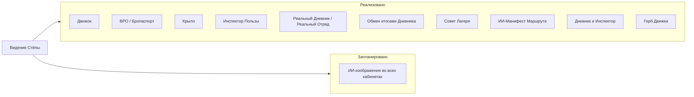

# Видение Стёпы: личный кабинет

Источник видения продукта по механикам личного кабинета. При разработке ЛК ориентироваться на этот документ.

---

## Фокус: развитие и творчество, не соревновательность

- **Акцент:** развитие 4К навыков (Коллаборация, Критическое мышление, Креативность, Коммуникация).
- **Не приоритет:** соревновательные механики (рейтинги, «Битва Движков»). **Лента с лайками** — релевантная механика, остаётся в приоритетах разработки.
- **Все существующие функции сохраняются** — резервная копия, шеринг, мастерская, избранное, табы «В пути» / «Коллекция» / «Журнал» и т.д.

---

## Пять базовых механик личного кабинета

| Механика | Статус | Компонент / ai-data | Описание |
|----------|--------|---------------------|----------|
| **Движок** | Реализован | [TeamDashboard.tsx](../src/components/TeamDashboard.tsx), категория 8 | Объединение по интересам: СОЗДАТЬ/ВСТУПИТЬ, путь Движка (значки 8.1, 8.2 и т.д.) |
| **Реальный Дневник / Реальный Отряд** | Реализован | [RealDiaryDashboard.tsx](../src/components/RealDiaryDashboard.tsx), значок [2.6](../public/ai-data/category-2/2.6.json) | Реальный Дневник (Утро/День/Вечер, Рефлексия), блок Отряд (название, девиз, кричалки, приветствие, мемы), презентация итогов с данными отряда, обмен через Telegram, связь с Инспектором Пользы |
| **Совет Лагеря** | Реализован | [CouncilDashboard.tsx](../src/components/CouncilDashboard.tsx), значок [8.6](../public/ai-data/category-8/8.6.json) | Обзор инициатив и протоколов, связь с Движками (useTeam, скролл к Движку). Механика для объединения Движков. |
| **БРО** | Реализован | [BroInitiation.tsx](../src/components/BroInitiation.tsx), категория 9 | Бропаспорт, бродела, инициация. Школа будущих вожатых |
| **Крыло** | Реализован | [WingDashboard.tsx](../src/components/WingDashboard.tsx) | Наставник, статус (БРО-НАСТАВНИК / ПРОХОЖДЕНИЕ), создание посвящения отряда |

---

## Реальный Дневник / Реальный Отряд (детализация)

**Источник:** методика значка 2.6 «Реальный Дневник», [public/ai-data/category-2/2.6.json](../public/ai-data/category-2/2.6.json).

**Суть:** рефлексия, осмысление опыта, сохранение воспоминаний, передача традиции. В контексте игры — адаптация под сообщество «Отряд»: общая инфа, обмен опытом, поддержка.

**Возможные функции в ЛК:**
- Ведение дневника (записи, заметки по дням/смене)
- Презентация итогов, обмен с другими участниками
- Связь с веткой «Инспектор Пользы» (рефлексия, миссии)

---

## Совет Лагеря (детализация)

**Источник:** значок 8.6 «Совет Реального Лагеря», [public/ai-data/category-8/8.6.json](../public/ai-data/category-8/8.6.json).

**Суть:** высший орган соуправления. Объединяет представителей Движков, Бро-движения, Бро-отрядов + вожатых и организаторов. Идеи → решения → задачи → артефакты.

**Функция в ЛК:**
- Точка входа для участия в Совете
- Обзор инициатив, протоколов, решений
- Связь с Движками: Совет — следующий уровень после создания/развития Движка

---

## Существующие блоки в ProfileView (сохраняются)

- **Подтверждение значка:** полная анкета восстановлена — опыт (learned), влияние (impact), ссылка (link), фото (загрузка + подсказка про вложения в Telegram). Все поля в proofForm отображаются в UI; при отправке формируется сообщение в Telegram и при наличии — сохраняется evidence в progress.
- Паспорт (аватар, ранг, XP)
- Ветка: Инспектор Пользы ([InspectorDashboard](../src/components/InspectorDashboard.tsx))
- День N: Миссия (Миссия Вежливости, Миссия Дружбы и т.д.)
- Твой Движок ([TeamDashboard](../src/components/TeamDashboard.tsx))
- Бропаспорт ([BroInitiation](../src/components/BroInitiation.tsx))
- День 3: Действие и Артефакт (бродела)
- Табы: В пути, Коллекция, Журнал, Мастерская, Избранное
- Пригласить друзей
- Шеринг достижений
- Резервная копия, экспорт/импорт

---

## Сводка механик (реализовано vs запланировано)

---

## Запланировано / кандидаты механик

Перечень механик-кандидатов для следующих итераций; приоритет и выбор — по [ROADMAP_2026.md](ROADMAP_2026.md) и решению продукта.

1. **Обмен итогами Реального Дневника с другими участниками** *(Done, 2026-02)*  
   Реализовано: кнопка «Отправить в Telegram» в RealDiaryDashboard (паттерн как в proofForm и модалке инициатив); тост, fallback на копирование при ошибке. ROADMAP Done.

2. **ИИ-Манифест Маршрута** *(Done, ROADMAP Done)*  
   Источник: [ANALYSIS_AND_VISION_2026.md](../ANALYSIS_AND_VISION_2026.md) §2. При добавлении значка в путь или старте маршрута — генерация карточки «намерения» (текст от ИИ или шаблон): «Я выбираю путь [значок], чтобы прокачать [навык]. Мой вызов на сегодня — [задание от НейроВалюши]». Формат 9:16, возможность в сторис/шеринг.

3. **Герб Движка (визуал команды)** *(Done, ROADMAP Done)*  
   Источник: [ANALYSIS_AND_VISION_2026.md](../ANALYSIS_AND_VISION_2026.md) §2. Реализовано: кнопка «Создать визуал команды» в [TeamDashboard.tsx](../src/components/TeamDashboard.tsx), POST /api/teams/gerb-generate (OpenAI GPT Image 1.5), выбор стиля, получение изображения 9:16 с ником/названием Движка.

4. **ИИ-изображения во всех кабинетах** *(Not started)*  
   Во всех разделах ЛК, где пользователь может добавить изображение, три опции: **загрузить своё** / **сгенерировать ИИ** / **загрузить и обработать ИИ**. Генерация — с учётом формата раздела (значок, флаг, обложка, аватар и т.д.). Обработка — сохранение особенностей загруженного + стилизация РЛ (галстуки, БРО, космос; для людей — пресет с котиками и галстуками). Провайдеры: OpenAI GPT Image 1.5 (по умолчанию) + российские (Fusion Brain, YandexART, GigaChat, Alice). Целевые разделы: Отрядный уголок, Крыло, Паспорт, Мастерская, скины значков, флаг Движка, отряд вожатых, Бропаспорт.

5. **Улучшение связности Реальный Дневник ↔ Инспектор** *(Done, ROADMAP Done)*  
   Уже есть скролл к Инспектору и подсказка. Возможное усиление: явные CTA или подсказки по миссиям Инспектора на основе записей в дневнике (без обязательной интеграции с ИИ на первом шаге).

---

## Связь с ROADMAP и Memory Bank

- Приоритеты разработки: [ROADMAP_2026.md](ROADMAP_2026.md)
- Детальный лог: [.memory-bank/progress.md](../.memory-bank/progress.md)
- Product logic: [.memory-bank/product_logic.md](../.memory-bank/product_logic.md)
