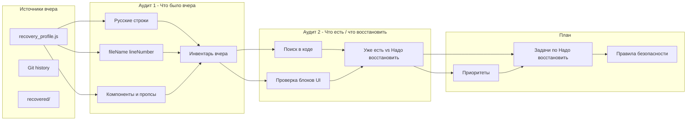

# Воркфлоу восстановления прогресса после потери кода

## Контекст

Агент удалил значительную часть наработок (в т.ч. в `src/views/ProfileView.tsx`). «Вчерашний» скомпилированный билд сохранён в `recovery_profile.js` (~186k символов) — это единственный надёжный «цифровой отпечаток» полного состояния. В билде видны ссылки на исходники с номерами строк (например `ProfileView.tsx`, lineNumber:1180, 1201, 1236, 1237), то есть исходный ProfileView был порядка **1200+ строк**; текущий — **~310**. Папка `recovered/` — слепок проекта на момент восстановления (частичный). Memory Bank (`.memory-bank/progress.md`) фиксирует вехи, но не построчную разницу.

## Цель

Иметь **повторяемый процесс** с двумя аудитами, чтобы **однозначно понимать**:

- **что из вчерашнего надо восстановить** (пропуски, отсутствующие фичи и тексты);
- **что уже сделано** (есть в текущем коде и совпадает с билдом).

Итог процесса: исчерпывающий отчёт «восстановить / уже есть» и приоритизированный план восстановления без повторных потерь.

---

## Два аудита (обязательная последовательность)

- **Аудит 1 — «Что было вчера»:** инвентаризация по билду и артефактам. Результат: фиксированный список фич, строк, блоков и пропсов, которые считаем эталоном «вчера».
- **Аудит 2 — «Что есть сейчас vs что надо восстановить»:** сверка инвентаря с текущим кодом по каждому пункту. Результат: разбиение на две категории — **уже есть** (не трогаем) и **надо восстановить** (план работ).

Без второго аудита легко начать «восстанавливать» то, что уже восстановлено, или пропустить незаметные расхождения. Повторный проход по чеклисту после Аудита 2 (проверка «ничего не забыли») допустим как опциональный мини-аудит перед началом восстановления.

---

## 1. Источники истины «вчера»

| Источник | Что даёт | Ограничения |
|----------|----------|--------------|
| **recovery_profile.js** | Полный скомпилированный чанк: все строки UI, вызовы API, имена компонентов, `fileName` + `lineNumber` из исходников. Главный источник для сверки. | Минификация, нет структуры React — только данные и строки. |
| **Git** | История коммитов; можно попытаться восстановить файлы через `git show` / `git checkout` по хэшу до инцидента. | Если удалённый код не был закоммичен, Git не поможет. |
| **recovered/** | Слепок файловой структуры и части кода на момент восстановления. | Неполный (меньше компонентов), может быть уже «починенной» версией. |
| **docs/log_agent_workflow.txt** | Описание изменений агентов (номера строк, фичи: Share Center, автоскролл #share, CTA). | Ссылки на старые номера строк; не заменяет полную сверку. |

**Рекомендация:** считать основным источником **recovery_profile.js**; Git использовать для восстановления целых файлов только если есть коммит до удаления; recovered/ и лог — вспомогательно для интерпретации.

---

## 2. Аудит 1 — Инвентаризация «вчера» (извлечение из билда)

**Задача:** однозначно зафиксировать, что было во «вчерашнем» состоянии. Без изменения кода — только чтение и вывод отчётов.

1. **Строки на русском и ключевые UI-фразы**  
   Из `recovery_profile.js` извлечь все подстроки в кавычках, содержащие кириллицу (регулярка или скрипт). Сохранить в список «ожидаемых» строк (например `docs/recovery_expected_strings.txt` или JSON). Скрипт: `scripts/extract-recovery-inventory.mjs` → `docs/recovery_inventory.json`.

2. **Имена файлов и номера строк**  
   Из того же файла вытащить все вхождения `fileName:"...ProfileView.tsx",lineNumber:...` (и при необходимости другие view/component). По ним понять границы блоков и сопоставить с логикой (Share Center, приглашение друзей, мастерская, импорт).

3. **Компоненты и пропсы**  
   По билду зафиксировать: hideNickname, два вызова generateSocialCard (story + wide), shareOrDownloadSocialCard, exportData/импорт (restore from file).

4. **Скрипт извлечения**  
   `node scripts/extract-recovery-inventory.mjs` — читает `recovery_profile.js`, вытаскивает русские строки и пары (fileName, lineNumber); сохраняет в `docs/recovery_inventory.json`.

**Итог Аудита 1:** артефакт **«Инвентарь вчера»** — `docs/recovery_inventory.json`, при необходимости `docs/recovery_expected_strings.txt`. Это эталон для второго аудита.

---

## 3. Аудит 2 — Сверка с текущим кодом («что восстанавливать» / «что уже есть»)

**Задача:** для каждого пункта из Инвентаря вчера проверить наличие в текущем коде и зафиксировать: **уже есть** или **надо восстановить**. Итог — чёткое разделение, без догадок.

1. **По файлам**  
   Для каждого ключевого файла (ProfileView.tsx, при необходимости BadgeLevelView, InspectorDashboard, TeamDashboard, BroInitiation, socialGenerator) проверить наличие ожидаемых строк и блоков UI из инвентаря.

2. **По компонентам**  
   Сверить импорты и использование в ProfileView: InspectorDashboard, TeamDashboard, BroInitiation, WingDashboard, ChatBot, ChatAvatar, SquadArchitect, generateSocialCard / shareOrDownloadSocialCard, fetchAiSlogan, exportData, обработчик импорта (input file).

3. **Чеклист с двумя исходами: «уже есть» / «надо восстановить»**  
   Для каждой фичи/строки/блока из Инвентаря явно проставить: **Уже есть** (файл:строка) или **Надо восстановить** (что добавить/исправить).

**Итог Аудита 2:** документ **«Отчёт сверки»** — `docs/recovery_audit_report.md` с двумя секциями: **«Уже есть»** и **«Надо восстановить»**. План восстановления составляется только по секции «Надо восстановить».

---

## 4. План восстановления (100%)

План строится **только по пунктам из Аудита 2 с исходом «Надо восстановить»**.

1. **Приоритизация**  
   Критично: экспорт/импорт, резервная копия. Высокий: Share Center (два формата, hideNickname, shareOrDownloadSocialCard), автоскролл по хэшу, «Пригласить друзей». Высокий: полный флоу Мастерской (confirm, Telegram, карточка Созидателя). Средний: мелкие тексты, стили.

2. **Разбивка по задачам**  
   Каждую группу из чеклиста оформить отдельной задачей с критерием приёмки. См. `docs/recovery_restoration_plan.md`.

3. **Правила безопасности при восстановлении**  
   Перед правками: `git add .` и/или коммит. Вносить изменения точечно (search_replace), не перезаписывать файл целиком. После каждой группы правок: `npm run self-check`, линтер; при необходимости коммит. Обновлять `.memory-bank/progress.md` после каждой крупной фичи.

---

## 5. Где хранить воркфлоу и артефакты

- **Воркфлоу:** этот документ — `docs/RECOVERY_PROGRESS_WORKFLOW.md`.
- **Артефакты прогона:**  
  - `docs/recovery_inventory.json` — результат Аудита 1;  
  - `docs/recovery_expected_strings.txt` — ключевые UI-строки для сверки;  
  - `docs/recovery_audit_report.md` — результат Аудита 2 («Уже есть» / «Надо восстановить»);  
  - `docs/recovery_restoration_plan.md` — план задач по пунктам «Надо восстановить».

---

## 6. Схема процесса

