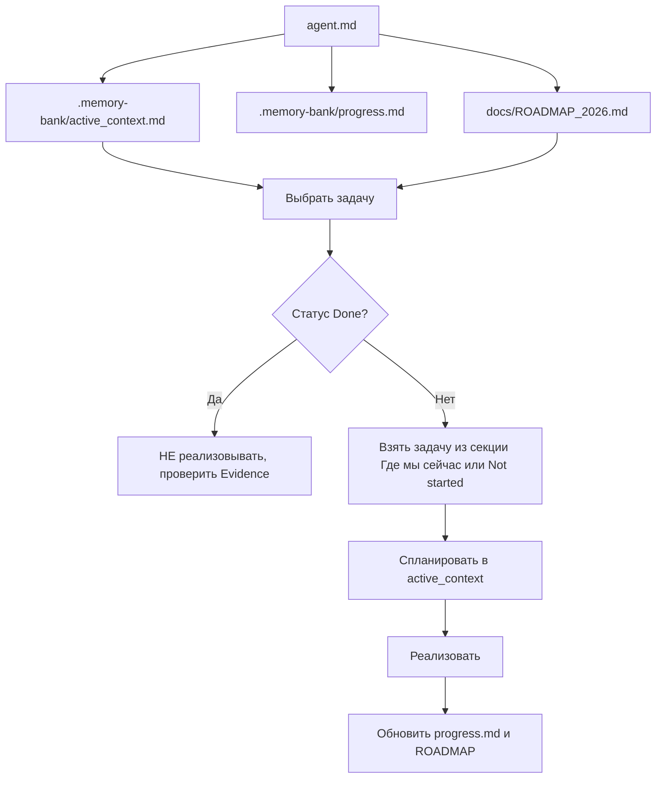

# Карта входа в проект и правила контекста

Чтобы перед началом работы всегда понимать, что уже сделано и не менять готовое, следуй этой карте.

## 1. Ключевые документы (где что искать)

| Тип | Путь | Назначение |
|-----|------|------------|
| **Дорожная карта** | [docs/ROADMAP_2026.md](ROADMAP_2026.md) | Единая точка истины: таблица статусов (Done/Not started), Evidence (ссылки на код), раздел «Где мы сейчас», список Completed (не перереализовывать) |
| **Файл прогресса** | [.memory-bank/progress.md](../.memory-bank/progress.md) | Детальный лог выполненного, Accepted UX (что не менять без явной задачи), Recent Changes |
| **Воркфлоу мобильной игры** | [WORKFLOW_GAME_CONCEPT_PLAN.md](../WORKFLOW_GAME_CONCEPT_PLAN.md) | Анализ репо, роли агентов A–E, Product Map, план работ, MVP-границы, DoD, чек-листы этапов; **код не меняем** — выводы только в этом файле |
| **Прогресс и планы (консолидация)** | [WORKFLOW_PROGRESS_AND_PLANS.md](../WORKFLOW_PROGRESS_AND_PLANS.md) | Разметка этапов Done/Not started, кабина и панели ЛК, матрица «План ↔ Код»; при детальном планировании геймдизайна/этапов |
| **Отчёты Codex** | [CODEX_ANALYSIS_2026-02-04.md](../CODEX_ANALYSIS_2026-02-04.md) | Состояние репо, staging/порты, шеринг по «моментам», CTA во всплывашке, техника MVP, дорожная карта A–D |
| **Доп. источники** | [REPORT_2026.md](../REPORT_2026.md), [ANALYSIS_AND_VISION_2026.md](../ANALYSIS_AND_VISION_2026.md) | Используются ROADMAP_2026; при расхождении — приоритет WORKFLOW_GAME_CONCEPT_PLAN |
| **Точка входа агента** | [agent.md](../agent.md) | Шпаргалка: Memory Bank, workflow, команды. Ссылается на `.memory-bank/` |
| **Оркестрация агентов** | [.cursor/agent orchestration/AGENT_ORCHESTRATION.md](../.cursor/agent%20orchestration/AGENT_ORCHESTRATION.md) | Claim Board: перед стартом — проверить и записать агента, задачу, следующий шаг. Сводка кто что сделал. |
| **Как давать задания агентам** | [HOW_TO_BRIEF_AGENTS.md](HOW_TO_BRIEF_AGENTS.md) | Куда направлять, что смотреть, где проверять, с чего начать выполнение |
| **Песочница и тест отряда вожатых** | [SANDBOX_TESTING.md](SANDBOX_TESTING.md) §6 | Тест сценария: Старший Вожатый создаёт отряд, вожатый входит по коду/ссылке |
| **Memory Bank** | [.memory-bank/](../.memory-bank/) | `active_context.md` (текущая задача), `progress.md`, `tech_context.md`, `project_brief.md`, `product_logic.md` |
| **Видение ЛК** | [docs/STEPA_VISION_LC.md](STEPA_VISION_LC.md) | Видение Стёпы по механикам личного кабинета, приоритет развития и 4К навыков (без соревновательности) |

---

## 2. Где мы сейчас (по ROADMAP_2026)

- **Фокус:** Песочница — Done. Auth flow — Done. Роли, авторизация, адаптация ЛК — Done. Кабина космического корабля (ЛК) — Done.
- **Следующая задача:** выбрать из видения и планов: [STEPA_VISION_LC.md](STEPA_VISION_LC.md), [FEATURE_AUTH_ROLES_DVIZHKI_PLAN.md](FEATURE_AUTH_ROLES_DVIZHKI_PLAN.md), [WORKFLOW_GAME_CONCEPT_PLAN.md](../WORKFLOW_GAME_CONCEPT_PLAN.md) — или новая инициатива. Унификация ЛК выполнена (единая точка входа main.tsx, кабина на 3001/3002/3010).

---

## 3. Правило «не трогать готовое»

1. **Перед задачей из ROADMAP:** проверить статус в таблице [ROADMAP_2026](ROADMAP_2026.md). Если **Done** — не реализовывать; при сомнении — проверить Evidence.
2. **Accepted UX** в [progress.md](../.memory-bank/progress.md): например, всплывашка «О концепции игры» — поведение зафиксировано, доработки не требуются.
3. **Completed** в ROADMAP — плоский список того, что уже сделано; при расхождении — опираться на Evidence.

---

## 4. Рекомендуемый порядок входа в проект

**Кто даёт задания агентам:** см. [HOW_TO_BRIEF_AGENTS.md](HOW_TO_BRIEF_AGENTS.md) — куда направлять, что смотреть, где проверять, с чего начать.

### Чек-лист перед началом работы

1. Прочитать [agent.md](../agent.md).
2. Открыть [.memory-bank/active_context.md](../.memory-bank/active_context.md) — понять текущий фокус и свою роль (A/B/C/D/E).
3. Открыть [AGENT_ORCHESTRATION.md](../.cursor/agent%20orchestration/AGENT_ORCHESTRATION.md) — проверить Claim Board; при взятии задачи — записать агента, задачу, дату, следующий шаг.
4. Открыть [docs/ROADMAP_2026.md](ROADMAP_2026.md):
   - проверить «Где мы сейчас»;
   - убедиться, что выбранная задача **не в списке Done**;
   - при необходимости — свериться с Evidence.
5. Просмотреть [.memory-bank/progress.md](../.memory-bank/progress.md) — раздел «Accepted UX» и «Recent Changes».
6. Для задач по личному кабинету — свериться с [STEPA_VISION_LC.md](STEPA_VISION_LC.md) (видение, базовые механики, приоритет развития 4К).
7. Для задач, связанных с геймдизайном/методикой — учесть [WORKFLOW_GAME_CONCEPT_PLAN.md](../WORKFLOW_GAME_CONCEPT_PLAN.md) (особенно разделы 11 и чек-листы этапов).

---

## 5. Сводка ролей и воркфлоу (из WORKFLOW)

- **Agent A:** Данные, `public/ai-data`, модели прогресса.
- **Agent B:** UX и навигация, `src/views/`, `src/components/`.
- **Agent C:** НейроВалюша, `chatbot/`, system prompts.
- **Agent D:** Смыслы «О лагере», контент.
- **Agent E:** Технические ограничения (GitHub Pages, кэш, деплой).

При расхождении приоритетов — ориентир [WORKFLOW_GAME_CONCEPT_PLAN.md](../WORKFLOW_GAME_CONCEPT_PLAN.md).
