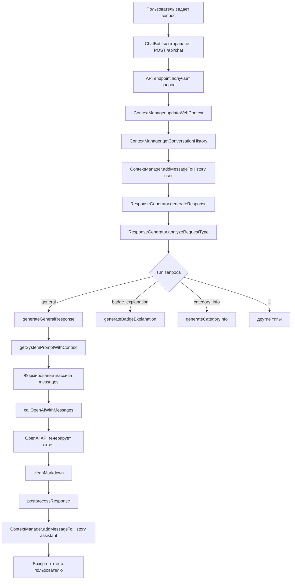

# Исследование промтов и ответов бота НейроВалюши

## Обзор

Полное исследование архитектуры промтов, формирования ответов и обработки вопросов о сменах, датах и ценах в проекте Путеводитель "Реальный Лагерь".

**Дата исследования:** 2025-01-27  
**Последнее обновление промптов:** 2026-01-14

---

## Архитектура проекта

Проект содержит две реализации бота:

1. **JavaScript версия** (`backend/`)
   - Используется на Vercel/GitHub Pages
   - Файлы: `backend/system_prompt.js`, `backend/response_generator.js`, `backend/api/index.js`
   - API endpoint: `/api/chat`

2. **Python версия** (`chatbot/`)
   - FastAPI сервер (локально на порту 8000)
   - Файлы: `chatbot/prompts/putevoditel_system_prompt_optimized.py`, `chatbot/core/response_generator.py`, `chatbot/main.py`
   - API endpoint: `/chat`

---

## Структура системных промптов

### JavaScript версия

**Файл:** `backend/system_prompt.js`

- **Основной промпт:** Константа `SYSTEM_PROMPT` (строка 2-434)
- **Функция контекста:** `getSystemPromptWithContext()` (строка 437-480)
- **Размер:** ~4000+ токенов

### Python версия

**Файл:** `chatbot/prompts/putevoditel_system_prompt_optimized.py`

- **Основной промпт:** Константа `PUTEVODITEL_SYSTEM_PROMPT_OPTIMIZED` (строка 8-434)
- **Функция контекста:** `get_system_prompt_with_context()` в `chatbot/prompts/system_prompt.py`
- **Размер:** ~4000 токенов (оптимизированная версия)

---

## Информация о сменах в промптах

### Расположение информации

Информация о сменах находится в трех местах в системном промпте:

#### 1. Секция "💰 Стоимость смен (2026 год)"
- **Строки:** 80-110 (JS), 86-114 (Python)
- **Содержимое:**
  - Весенняя смена 2026 (АКТУАЛЬНО)
  - Примечание о цене с максимальной скидкой
  - Будущие смены 2026 (майский выезд, летняя смена)
  - Алгоритм оплаты

#### 2. Секция "🌷 АКТУАЛЬНАЯ СМЕНА - ВЕСНА 2026"
- **Строки:** 200-218 (JS), 206-224 (Python)
- **Содержимое:**
  - Название смены
  - Даты
  - Стоимость (с сертификатом и без)
  - Возраст
  - Место
  - Особенности смены

#### 3. Примеры ответов
- **Строки:** 420-435 (JS), 426-435 (Python)
- **Содержимое:** Примеры ответов на вопросы о сменах

### Синхронизация стоимости

Стоимость синхронизирована между версиями промптов:

| Файл | Строка | Стоимость | Версия |
|------|--------|-----------|--------|
| `backend/system_prompt.js` | 85 | **25 800 / 36 500 рублей** | JS |
| `backend/system_prompt.js` | 206 | **25 800 / 36 500 рублей** | JS |
| `backend/system_prompt.js` | 432 (пример) | **25 800 / 36 500 рублей** | JS |
| `chatbot/prompts/putevoditel_system_prompt_optimized.py` | 91 | **25 800 / 36 500 рублей** | Python |
| `chatbot/prompts/putevoditel_system_prompt_optimized.py` | 212 | **25 800 / 36 500 рублей** | Python |
| `chatbot/prompts/putevoditel_system_prompt_optimized.py` | 435 (пример) | **25 800 / 36 500 рублей** | Python |

**Вывод:** Несоответствие устранено, обе версии используют единые значения для весенней смены 2026.

---

## Поток формирования ответа

### Полный цикл обработки вопроса



### Детальный разбор обработки вопроса о смене

Когда пользователь спрашивает: **"Какая следующая смена?"** или **"Сколько стоит смена?"**

1. **Фронтенд (ChatBot.tsx:152-168)**
   - Отправляет POST на `/api/chat`
   - Формат запроса:
     ```json
     {
       "message": "Какая следующая смена?",
       "user_id": "web_user",
       "context": {
         "current_view": "intro",
         "current_category": null,
         "current_badge": null,
         "current_level": null,
         "current_level_badge_title": null
       }
     }
     ```

2. **API Endpoint (backend/api/index.js:46-91)**
   - Обновляет веб-контекст: `contextManager.updateWebContext(user_id, context)`
   - Получает историю диалога: `contextManager.getConversationHistory(user_id)`
   - Добавляет сообщение пользователя в историю
   - Вызывает генератор ответов: `responseGenerator.generateResponse(message, user_id, conversationHistory)`

3. **ResponseGenerator.generateResponse (backend/response_generator.js:17-77)**
   - Получает контекст пользователя: `contextManager.getUserContext(userId)`
   - Дополняет контекст: `contextManager.detectContextFromMessage(userId, userMessage)`
   - Определяет тип запроса: `analyzeRequestType(userMessage, userContext)`

4. **analyzeRequestType (backend/response_generator.js:80-159)**
   - Анализирует сообщение на ключевые слова
   - Для вопросов о сменах не находит специфичных триггеров
   - Возвращает тип: **"general"** (строка 158)

5. **generateGeneralResponse (backend/response_generator.js:443-476)**
   - Формирует системный промпт: `getSystemPromptWithContext(context)`
   - Системный промпт включает:
     - Базовый `SYSTEM_PROMPT` с информацией о сменах
     - Дополнительный контекст (текущий экран, категория, значок)
   - Формирует массив сообщений:
     ```javascript
     [
       { role: "system", content: systemPrompt },
       ...conversationHistory.slice(-10), // последние 10 сообщений
       { role: "user", content: message }
     ]
     ```
   - Отправляет в OpenAI: `callOpenAIWithMessages(messages, 1000, 0.7)`

6. **OpenAI API (backend/response_generator.js:602-616)**
   - Модель: `gpt-4o-mini`
   - Max tokens: 1000
   - Temperature: 0.7
   - OpenAI использует системный промпт с информацией о сменах для генерации ответа

7. **Постобработка (backend/response_generator.js:59-63)**
   - Очистка markdown: `cleanMarkdown(response)`
   - Постобработка: `postprocessResponse(response)`
   - Возврат ответа пользователю

---

## Ключевые компоненты

### 1. Системный промпт

**JS версия:** `backend/system_prompt.js`

Содержит:
- Личность бота (НейроВалюша)
- Стиль общения
- Информацию о лагере
- **Информацию о сменах (строки 80-110, 200-218)**
- Систему значков
- Примеры ответов

**Python версия:** `chatbot/prompts/putevoditel_system_prompt_optimized.py`

Аналогичная структура, стоимость синхронизирована с JS версией.

### 2. ResponseGenerator

**JS версия:** `backend/response_generator.js`

Методы:
- `generateResponse()` - главный метод генерации ответа
- `analyzeRequestType()` - определение типа запроса
- `generateGeneralResponse()` - генерация общего ответа (для вопросов о сменах)
- `callOpenAIWithMessages()` - вызов OpenAI API

**Python версия:** `chatbot/core/response_generator.py`

Аналогичная структура, метод `_generate_general_response()` (строка 561-587).

### 3. ContextManager

**JS версия:** `backend/context_manager.js`

Методы:
- `updateWebContext()` - обновление контекста из веб-интерфейса
- `detectContextFromMessage()` - определение контекста из сообщения
- `getConversationHistory()` - получение истории диалога
- `addMessageToHistory()` - добавление сообщения в историю

**Python версия:** `chatbot/core/context_manager.py`

Аналогичная структура с соответствующими методами.

### 4. API Endpoints

**JS версия:** `backend/api/index.js`
- Endpoint: `/api/chat`
- Метод: POST
- Обрабатывает запросы от фронтенда

**Python версия:** `chatbot/main.py`
- Endpoint: `/chat`
- Метод: POST
- FastAPI обработчик

---

## Как бот отвечает на вопросы о сменах

### Пример вопроса: "Какая следующая смена?"

1. Запрос проходит через `analyzeRequestType()`
2. Не находит специфичных триггеров → тип "general"
3. Вызывается `generateGeneralResponse()`
4. Системный промпт включает секцию:
   ```
   ## 🌷 АКТУАЛЬНАЯ СМЕНА - ВЕСНА 2026
   
   ### «Весенняя смена в Реальном Лагере»
   
   **📅 Даты**: с 28.03.2026 по 05.04.2026 (9 дней)
   **💰 Стоимость с сертификатом СПб**: 25 800 рублей
   **💰 Полная стоимость без сертификата**: 36 500 рублей
   ...
   ```
5. OpenAI генерирует ответ на основе промпта
6. Ответ может выглядеть как в примере (строка 420-423):
   ```
   🌷 Сейчас актуальна весенняя смена «Весенняя смена в Реальном Лагере»!  
   📅 Даты: с 28.03.2026 по 05.04.2026 (9 дней)  
   💰 Стоимость: 25 800 рублей с сертификатом СПб (полная стоимость без сертификата — 36 500 рублей)  
   🎯 Тематика: 4К-навыки + нейросети для обучения и творчества. Запись уже началась на весну, майский выезд и лето — пишите Стёпе или Вале! 😊
   ```

### Пример вопроса: "Сколько стоит смена?"

Аналогичный процесс, но OpenAI использует информацию о стоимости из промпта (строки 85/86 или 206/212).

**Важно:** OpenAI не просто копирует текст из промпта, а генерирует ответ в стиле НейроВалюши, используя информацию из промпта как источник данных.

---

## Порты и серверы

| Компонент | Порт | Файл конфигурации |
|-----------|------|-------------------|
| Frontend (Vite) | 3001 | `package.json` (строка 7) |
| Flask API | 4000/5000 | `backend/app.py` (строка 413) |
| FastAPI ChatBot | 8000 | `chatbot/main.py` (строка 309) |
| Vercel API | - | `backend/api/index.js` |

**Примечание:** Порт 3002 не используется в проекте. Возможно, имелось в виду порт 3001 (Frontend).

---

## Синхронизация промптов

### Статус

JS и Python версии промптов синхронизированы по стоимости (25 800 / 36 500 рублей), но остаются различия:
1. Незначительные расхождения в тексте (например, "старше 12 лет" vs "от 12 до 17 лет")
2. Различия в формулировках примеров ответов

### Рекомендации

1. **Определить единый источник истины** для информации о сменах
2. **Создать скрипт синхронизации** для автоматического обновления промптов
3. **Добавить валидацию** при деплое для проверки соответствия версий
4. **Использовать общий файл данных** (например, JSON) для актуальной информации о сменах

---

## Выводы

1. **Архитектура:** Две версии бота (JS и Python) работают параллельно
2. **Промпты:** Информация о сменах встроена в системный промпт (строки 80-110, 200-218)
3. **Обработка вопросов:** Вопросы о сменах обрабатываются через `generateGeneralResponse()` (тип "general")
4. **Несоответствия:** Стоимость синхронизирована, остаются различия в тексте и формулировках
5. **Рекомендация:** Нужна синхронизация промптов и единый источник данных для смен

---

## Файлы для дальнейшего изучения

- `backend/system_prompt.js` - JS системный промпт
- `chatbot/prompts/putevoditel_system_prompt_optimized.py` - Python системный промпт
- `backend/response_generator.js` - JS генератор ответов
- `chatbot/core/response_generator.py` - Python генератор ответов
- `backend/context_manager.js` - JS менеджер контекста
- `chatbot/core/context_manager.py` - Python менеджер контекста
- `backend/api/index.js` - JS API endpoint
- `chatbot/main.py` - Python API endpoint
- `src/components/ChatBot.tsx` - React компонент чата
